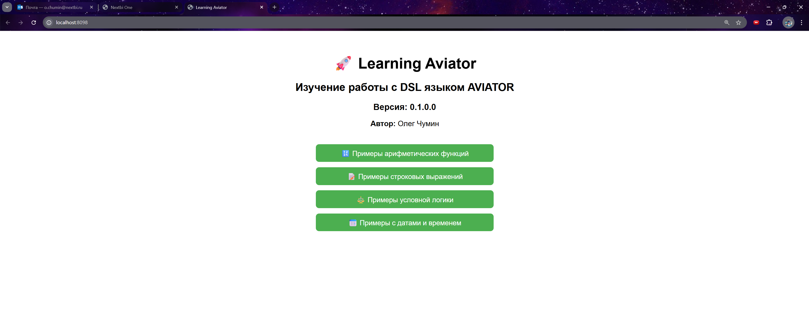

# Learning Aviator

Проект для изучения и практики работы с DSL-движком [Aviator](https://github.com/killme2008/aviator).

Автор: **Олег Чумин**

---

## 🚀 Описание

Данный проект является учебным и служит базой для:

- Знакомства с [Aviator Expression](https://github.com/killme2008/aviator)
- Интеграции его с Java-кодом
- Создания пользовательских функций и регистрации их в DSL
- Изучения взаимодействия с Spring Boot + Thymeleaf

---

## ✅ Что работает "из коробки" без регистрации:

- `now()` — возвращает `long` (timestamp).
- Арифметика: `+`, `-`, `*`, `/`, `%`, скобки, приоритеты.
- Логика: `&&`, `||`, `==`, `!=`, `>`, `<`, `>=`, `<=`, тернарный `? :`.
- Строковые функции: `string.contains`, `string.startsWith`, `string.endsWith`, `string.length`, `string.toUpperCase`, `string.toLowerCase`.

---

## 📦 Состав

- Java 21
- Spring Boot 3.5.3
- Aviator 5.4.3
- Thymeleaf (шаблонизатор)

---

## 🖥️ Как запустить

1. Клонируй репозиторий:

```bash
git clone https://github.com/<твой-профиль>/learning_aviator.git
cd learning_aviator
```

2. Собери и запусти приложение:

```bash
./gradlew bootRun
```

3. Открой в браузере: 👉 [http://localhost:8098](http://localhost:8098)

### Запуск через Docker

Сборка и запуск контейнера:

```bash
docker compose up -d --build
```

После запуска приложение доступно по адресу: 👉 [http://localhost:8098](http://localhost:8098)

На Windows можно запустить приложение и автоматически открыть браузер одной командой:

```powershell
.\run-docker.ps1
```

Остановка контейнера:

```bash
docker compose down
```

---

## 📄 Главная страница

При запуске приложения открывается простая HTML-страница с описанием проекта:

> "Изучение работы с DSL языком AVIATOR, версия {appVersion}"
> 

---

## 🛠 Планы на развитие

- Добавить форму для ввода выражения Aviator и отображения результата
- Подключить логирование выполнения выражений
- Добавить примеры пользовательских функций с `@Import`

---

## 📃 Лицензия

Этот проект создан для обучения и не предполагает коммерческого использования.

